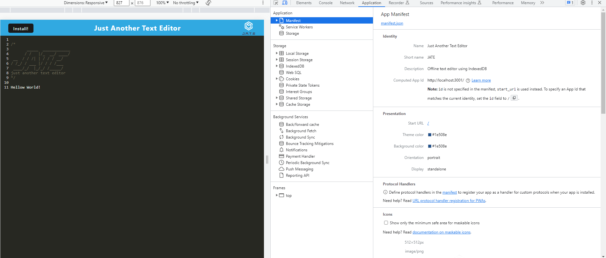
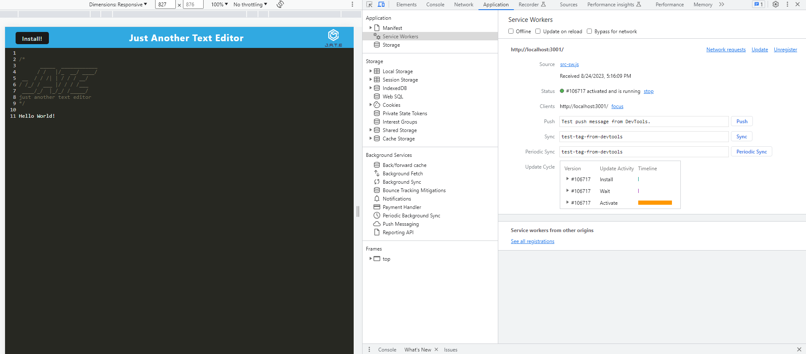
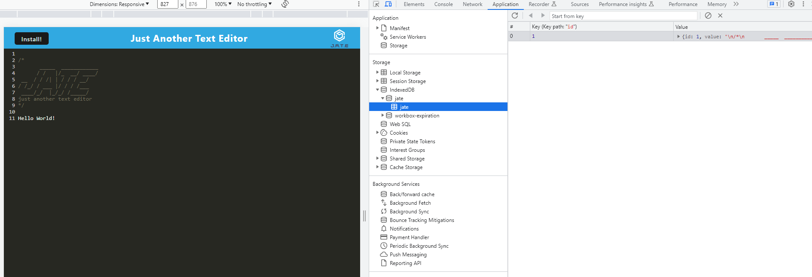
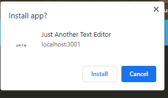
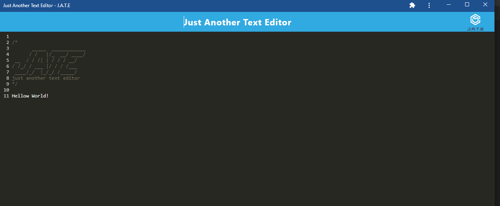

# PWA Text Editor
[](https://choosealicense.com/licenses/mit/)
## Description
This application is text editor that runs in the browser. The app will be a single-page application that meets the PWA criteria. Additionally, it will feature a number of data persistence techniques that serve as redundancy in case one of the options is not supported by the browser. It uses service workers, asset caching, and IndexedDB so that the application can function offline as well.

## Table of Contents
- [PWA Text Editor](#pwa-text-editor)
  - [Description](#description)
  - [Table of Contents](#table-of-contents)
  - [Languages \& Technologies Used](#languages--technologies-used)
  - [Installation](#installation)
  - [Usage](#usage)
  - [Questions](#questions)
  - [License](#license)


## Languages & Technologies Used


## Installation
First clone this repository to your local machine.

Now, install all required dependencies by using the following command:
```
npm install
```
Bundle the front end code by entering:
```
npm run build
```
Next, to start the server, use the command:
```
npm run start
```
Open the port on locahost.

## Usage
Once the application is open, you can type of text to be saved when you close and reopen. Manifest, service workers, and IndexedDB shown.









Click the install button on the top left of the application to install it on your local machine and be able to use it offline.





The app is now installed and ready to use without needing your browser.



## Questions
Check out my work at [github/dsoda86](https://github.com/dsoda86).


Please send your questions to  [dsoda86@gmail.com](mailto:dsoda86@gmail.com?subject=[GitHub]%20Dev%20Connect).
## License
[](https://choosealicense.com/licenses/mit/)


Click to learn more about this license and other commonly used licenses.
